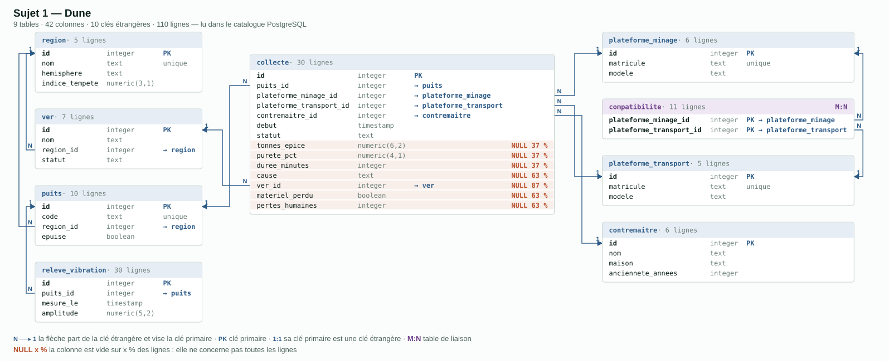

# Sujet 1 — Dune

> L'exploitation de l'épice sur Arrakis, telle qu'un DBA relationnel l'aurait
> modélisée. Neuf tables, **42 colonnes**, dix clés étrangères — et sept colonnes
> vides au moins une ligne sur trois. À transformer en modèle document.

## Référence

- Le schéma, tables et relations : `make dune-schema`
- Les chiffres à retrouver : `make dune-controle`
- La base, pour l'interroger : `make dune-sql`
- Le serveur d'arrivée : `make mongo`
- La correction, quand la vôtre sera faite : `git switch correction`,
  puis `make dune-verifier` — elle repose les six chiffres à MongoDB
- Le DDL : [`schema.sql`](schema.sql) · les données : [`donnees.sql`](donnees.sql)

---

## Le schéma SQL et ses relations



Le même schéma, en texte. `A ◄─── B` se lit « B porte la clé étrangère vers A ».

```
  region  ◄─── ver
          ◄─── puits  ◄─── releve_vibration   1:N ILLIMITE — une mesure par heure,
                                                            pour toujours

  plateforme_minage ────┐
  plateforme_transport ─┴── compatibilite   M:N PUR — deux cles, rien d'autre

  collecte ───► puits
           ───► plateforme_minage
           ───► plateforme_transport
           ───► contremaitre
           ───► ver        seulement si cause = 'VER' — NULL 26 fois sur 30

           statut = REUSSIE  ->  tonnes_epice, purete_pct, duree_minutes
           statut = ECHOUEE  ->  cause, ver_id, materiel_perdu, pertes_humaines
           l'autre moitie des colonnes est NULL, ligne apres ligne
```

| table | ce qu'elle porte | colonnes | lignes |
|---|---|---|---|
| `region` | le territoire : hémisphère, indice de tempête | 4 | 5 |
| `ver` | un ver des sables, rattaché à sa région de chasse | 4 | 7 |
| `puits` | un puits d'épice, foré dans une région | 4 | 10 |
| `plateforme_minage` | la moissonneuse qui descend sur le sable | 3 | 6 |
| `plateforme_transport` | le porteur qui la dépose et la relève | 3 | 5 |
| `compatibilite` | quel porteur soulève quelle moissonneuse | 2 | 11 |
| `contremaitre` | qui commande, de quelle maison, depuis combien d'années | 4 | 6 |
| `collecte` | le log d'une collecte : réussie **ou** échouée | **14** | 30 |
| `releve_vibration` | les capteurs au bord des puits, une ligne par mesure | 4 | 30 |
| | | **42** | |

Un tiers des colonnes de la base est dans `collecte`, et c'est voulu : le reste
n'est là que pour lui donner de quoi parler.

---

## Ce que ce schéma a dans le ventre

Quatre tensions ont été mises là exprès. Les reconnaître, c'est la moitié du sujet.

**1 — Une table, deux formes.** Une collecte réussie porte un tonnage, une pureté
et une durée ; une collecte échouée porte une cause, un ver, du matériel perdu et
des morts. Aucune des deux ne porte les colonnes de l'autre. SQL n'a pas le choix :
une seule table, toutes les colonnes, et des NULL. `make dune-schema` les compte —
`ver_id` est NULL 26 fois sur 30. Les deux `CHECK` `reussie_complete` et
`echouee_complete` écrivent noir sur blanc la règle que le type de la table ne sait
pas dire.

**2 — Une table de liaison qui ne porte rien.** `compatibilite` n'a que ses deux
clés. Elle n'existe que parce que SQL ne sait pas mettre une liste dans une colonne.

**3 — Un côté borné, un côté illimité.** Une région a cinq puits et ne bougera
plus ; un puits reçoit un relevé de vibration par heure, pour toujours. Les deux
sont des relations 1:N, et elles ne se traitent pas pareil.

**4 — Une jointure à cinq tables pour lire un log.** `make dune-controle` C5 —
« ce que chaque contremaître a sorti » — passe par `collecte`, `contremaitre`,
et il faut `puits` et `region` pour la C1. Un log qu'on lit beaucoup et qu'on
n'écrit qu'une fois est le candidat par excellence à la copie de ce dont il parle.

---

## Ce qui a été ajouté, ce qui a été retiré

Le schéma de départ était plus plat. Les modifications ci-dessous sont celles qui
rendent la transformation intéressante ; elles sont **déjà appliquées** dans
`schema.sql`.

### Ajouté

| ajout | pourquoi |
|---|---|
| `releve_vibration` | Il manquait une relation 1:N **non bornée**. Sans elle, tout s'embarque et le sujet n'a plus de décision à prendre : ici, embarquer les relevés dans le puits fait grossir le document sans fin. C'est le contre-exemple qui donne son sens aux autres embarquements. |
| les colonnes d'échec (`cause`, `ver_id`, `materiel_perdu`, `pertes_humaines`) | La consigne demandait « réussi ou échec, avec certaines informations pour l'un ou pour l'autre ». C'est ce qui fabrique le document polymorphe, la vraie leçon du sujet. |
| `compatibilite` | Un M:N **sans attribut**, pour l'opposer au reste : il devient un tableau, pas une collection. |
| `contremaitre.maison` et `.anciennete_annees` | Un contremaître était un simple nom. Deux attributs suffisent pour que la question « on le copie dans la collecte, ou on le référence ? » ait un coût à peser. |
| `region.indice_tempete` | Donne à `region` assez de substance pour qu'on ne la fusionne pas machinalement dans `puits`. |

### Retiré

| retrait | pourquoi |
|---|---|
| `collecte.region_id` | Redondant : la région se déduit du puits. Laissé en place, il aurait donné la réponse « copier la région dans la collecte » avant que la question soit posée. |
| une table `modele_plateforme` | `modele` reste une colonne texte. Une table de trois lignes lue partout n'apprend rien de plus que `compatibilite`, et allonge le schéma sans ajouter de décision. |
| `puits.contremaitre_id` | Un puits n'a pas de chef attitré : le contremaître est attaché à la **collecte**. Sinon deux chemins mènent au contremaître, et l'exercice devient une devinette. |

### Dégraissé

Le schéma tient dans un **budget de 42 colonnes**. Quatorze colonnes de décor sont
tombées : elles remplissaient les lignes sans jamais peser sur une décision de
modélisation. Aucune tension n'a été touchée — les sept colonnes NULL de `collecte`
sont toutes là, `compatibilite` aussi, `releve_vibration` aussi.

| colonnes tombées | pourquoi |
|---|---|
| `region.surface_km2` | Un nombre de plus dans une table qu'on lit, jamais qu'on décide. `indice_tempete` suffit à donner à `region` sa substance. |
| `ver.longueur_m`, `.derniere_apparition` | Le ver ne sert qu'à être cité par une collecte échouée. Son nom et son statut suffisent. |
| `puits.profondeur_m`, `.purete_moyenne`, `.ouvert_le` | La pureté qui compte est celle de **la collecte** (`purete_pct`), pas une moyenne dormante. Le reste est de l'habillage. |
| `plateforme_*.region_id` | Une plateforme se déplace : c'est la collecte qui dit où elle est descendue. La garder créait un second chemin vers `region`, et une fausse question. |
| `plateforme_*.capacite_tonnes`, `.charge_max_tonnes`, `.en_service` | `compatibilite` dit déjà qui soulève quoi. Un tonnage en double ne rend pas la question plus fine. |
| `contremaitre.region_id` | Même piège que `puits.contremaitre_id` : deux chemins vers la région. |
| `releve_vibration.alerte_ver` | Déductible de `amplitude` : un booléen recopié à côté du nombre qui le décide. La C6 le recalcule — elle n'y a jamais touché. |

---

## Exercices

Charger la base : `make dune`, puis ouvrir `make dune-sql` pour lire le SQL et
`make mongo` pour écrire les documents. La base MongoDB s'appelle `dune`.
Chaque exercice part de la base SQL telle quelle : aucun ne lit ce qu'un autre a écrit.

### Exercice 1

1. Lire le schéma (`make dune-schema`) et écrire, en une phrase par table, ce que
   chaque table représente et ce qui la relie aux autres.
2. Compter les collectes réussies et les collectes échouées.
3. Relever, pour chacun des deux cas, les colonnes qui sont systématiquement NULL.
4. Proposer les collections MongoDB du modèle cible, et pour chaque relation du
   schéma, dire si elle devient un sous-document, un tableau, une référence ou
   une copie — et pourquoi.
5. Écrire le document d'une collecte réussie et le document d'une collecte
   échouée, à la main, dans la collection `collectes`.
6. Compter les champs de l'un qui n'existent pas dans l'autre.

### Exercice 2

Peupler `dune` depuis le SQL.

1. Écrire la collection `regions` : une région, et dedans ses puits.
2. Écrire la collection `collectes` : une collecte, et dedans une copie du
   contremaître (nom, maison) et du puits (code, région).
3. Retrouver la C1 de `make dune-controle` — le tonnage par région — en une seule
   agrégation sur `collectes`, sans `$lookup`.
4. Retrouver la C4 — les vers qui ont fait échouer une collecte.
5. Écrire la collection `releves` et retrouver la C6.
6. Dire, en deux lignes, pourquoi `releves` n'est pas dans `regions`.

### Exercice 3

Le contremaître Duncan Idaho change de maison : il passe chez les Fremen.

1. Le modifier dans la collection qui le décrit.
2. Relancer la C5 de `make dune-controle` côté Mongo, et comparer à ce qu'elle
   donnait avant.
3. Contempler le bordel que cela pourrait engendrer à long terme.
4. Corriger, en une seule requête, toutes les collectes qui portent encore
   l'ancienne maison.
5. Dire ce qu'il aurait fallu embarquer, et ce qu'il aurait fallu référencer.

### Exercice 4  (Exploration)

Le puits `HAB-03` est épuisé. On veut le sortir du modèle sans perdre son histoire.

1. Supprimer le puits `HAB-03` de `regions`.
2. Compter les collectes qui le citent encore.
3. Sortir la liste des collectes dont le puits cité n'existe plus nulle part —
   sans écrire à la main la liste des puits vivants, et en une seule requête.
4. Faire en sorte que le serveur, et non le code, refuse la prochaine collecte
   qui citerait un puits inconnu.
